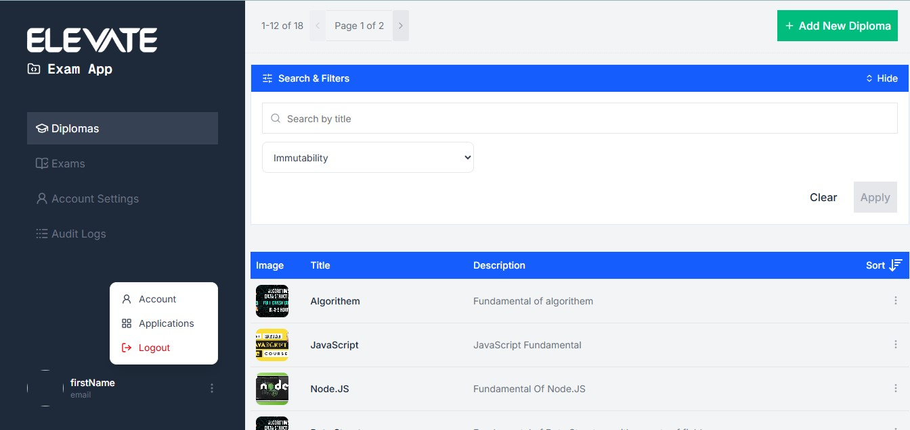
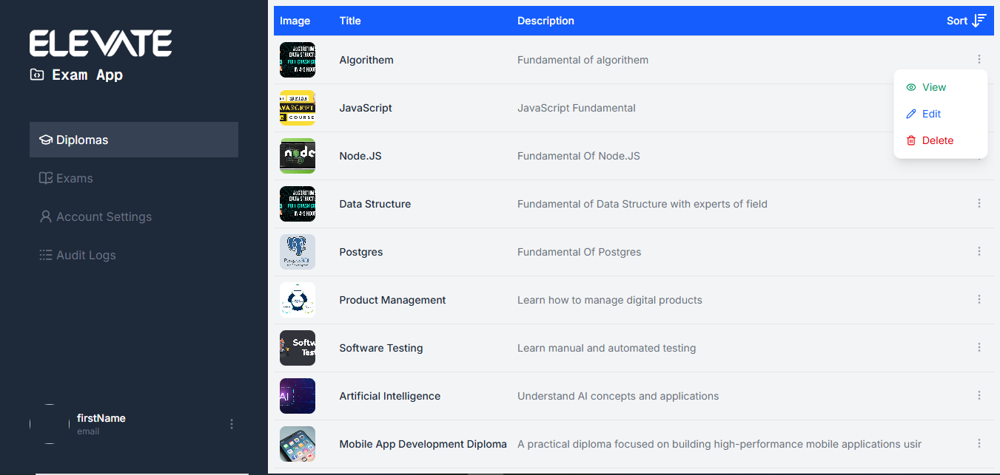
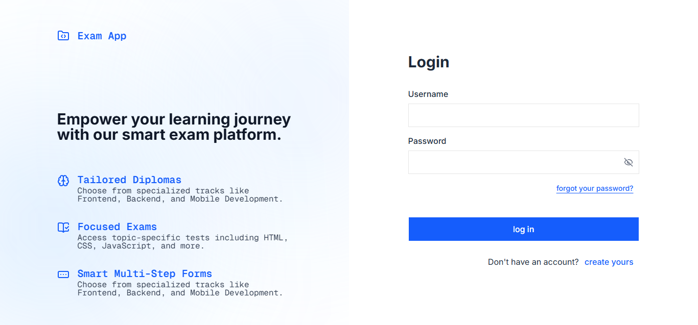
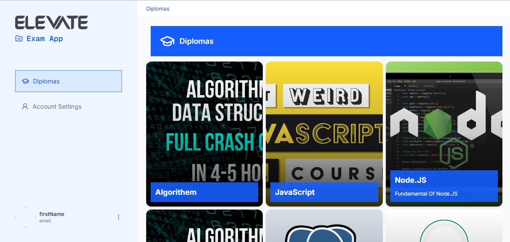
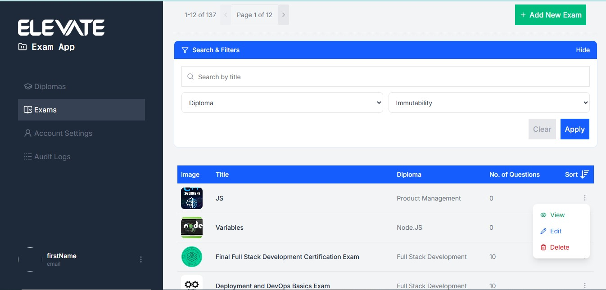
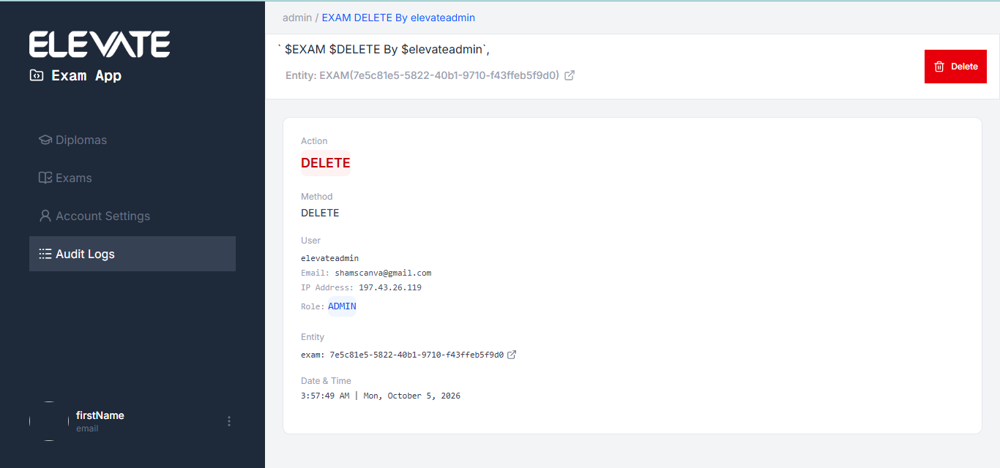
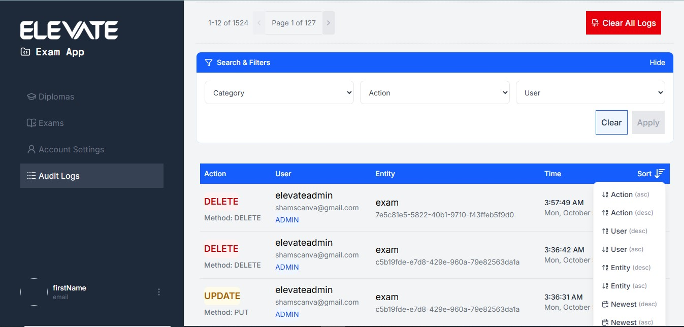
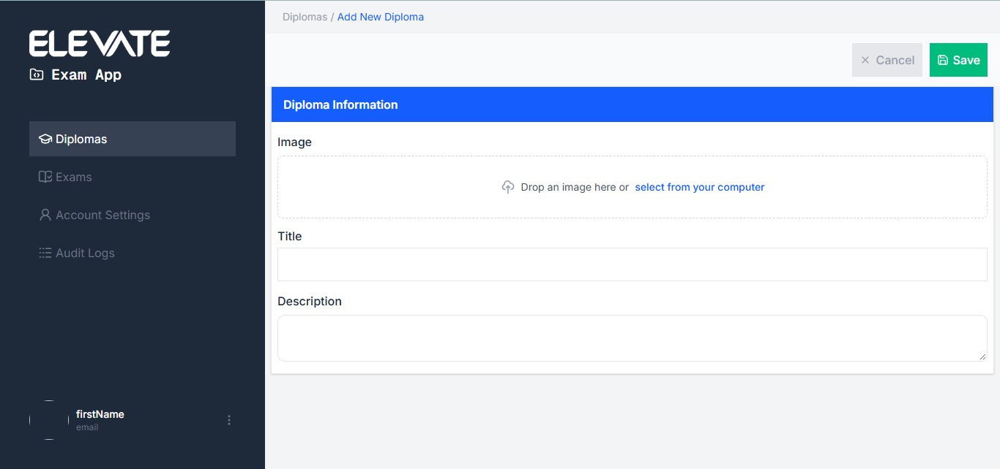

<div align="center">

# 🎓 Exam App

**A full-featured online exam platform for Elevate Bootcamp students and admins.**

[](https://YOUR-APP.vercel.app)




</div>

---

## ✨ Overview

Exam App digitizes the assessment workflow of a bootcamp. Students sign up, pick a **Diploma** (learning track), take timed **Exams**, and get an instant result with per-question analytics. Admins manage diplomas and exams from a dedicated dark-themed dashboard.

## 🚀 Live Demo

🔗 **https://YOUR-APP.vercel.app**

## 👥 Two Experiences

### 🧑‍🎓 Student
- Multi-step registration (Email → OTP → Info → Password)
- Login, forgot / reset password
- Browse diplomas and exams with infinite scroll
- Take an exam question-by-question with a **countdown timer** and **auto-submit**
- Result page with a **score donut chart** and selected-vs-correct answer review
- Profile, change email (OTP), change password

### 🛠️ Admin Dashboard
> ⚠️ The dashboard is only visible to admin accounts. Use the demo account below to explore it.

**Demo admin account**

| Field | Value |
|---|---|
| Username | `elevateadmin` |
| Password | `Elevate@123` |

- Paginated, searchable, filterable, sortable **diplomas table**
- Full CRUD: add (with image upload), view, edit, delete
- Exams management table with filters and delete



## 📸 Screenshots

| Login | Diplomas | Exam |
|---|---|---|
|  |  |  |

| Result | Admin Table | Add Diploma |
|---|---|---|
|  |  |  |

## 🧰 Tech Stack

| Layer | Tools |
|---|---|
| UI | React 19, TypeScript, Tailwind CSS 4, Base UI (shadcn-style kit) |
| Routing | React Router 7 |
| Server state | TanStack Query 5, Axios |
| Forms | React Hook Form, Zod |
| Tooling | Vite 8, oxlint |

## 📂 Project Structure

```
src/
├── components/ui/     # reusable UI kit
├── features/          # auth, diploma, exam, question, submission, upload, user, admin-dashboard
├── shared/            # axios instance, utils, shared components
└── stores/            # wizard step contexts
```

## ⚙️ Getting Started

```bash
git clone https://github.com/YOUR-USERNAME/exam-app.git
cd exam-app
npm install
cp .env.example .env
npm run dev
```

Open http://localhost:5173

### Environment variables

| Variable | Description |
|---|---|
| `VITE_API_BASE_URL` | Backend API origin |

### Scripts

| Command | Description |
|---|---|
| `npm run dev` | Start dev server |
| `npm run build` | Type-check and build for production |
| `npm run preview` | Preview the production build |
| `npm run lint` | Lint with oxlint |

## 👩‍💻 Author

**Your Name** · [LinkedIn](https://linkedin.com/in/YOUR-PROFILE) · [GitHub](https://github.com/YOUR-USERNAME)